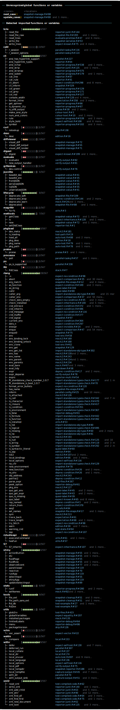
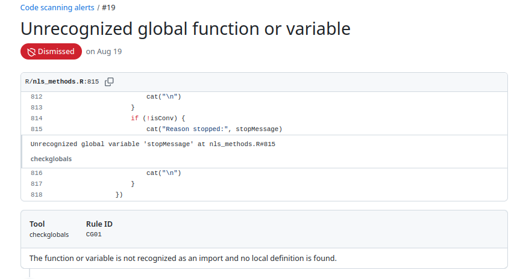
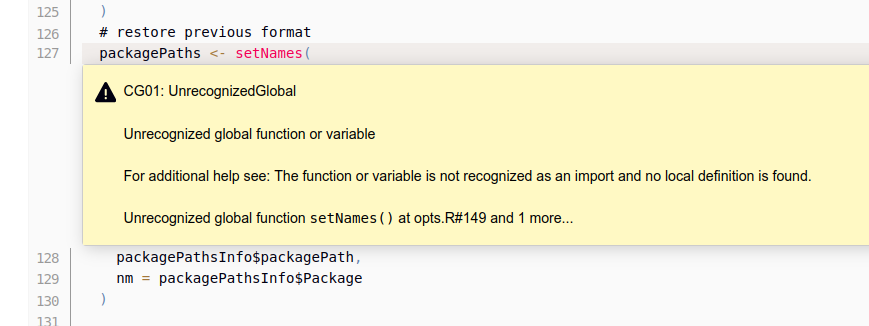

<!-- README.md is generated from README.Rmd. Please edit that file -->

# {checkglobals}

<!-- badges: start -->

[](https://cran.r-project.org/package=checkglobals)
[](https://github.com/JorisChau/checkglobals/actions)
[](https://app.codecov.io/gh/JorisChau/checkglobals)
[](https://CRAN.R-project.org/package=checkglobals)
<!-- badges: end -->

The minimal {checkglobals}-package allows to approximately detect global
and imported functions or variables from R-source code or R-packages by
statically inspecting the internal syntax trees of the code,
(i.e. [static code
analysis](https://en.wikipedia.org/wiki/Static_program_analysis)). The
aim of this package is to serve as a fast and light-weight alternative
to `codetools::findGlobals()` to check R-packages or R-scripts for
missing function imports and/or variable definitions on-the-fly without
the need for package installation or code execution. The code inspection
procedures are implemented using R’s internal C API for efficiency, and
no external R-package dependencies are strictly required, only
[cli](https://CRAN.R-project.org/package=cli) and
[knitr](https://CRAN.R-project.org/package=knitr) are suggested for
interactive use and checking Rmd documents respectively.

## Installation

``` r
# Install latest release from CRAN:
install.packages("checkglobals")

# Install the development version from GitHub:
# install.packages("devtools")
devtools::install_github("JorisChau/checkglobals")
```

## Example usage

### R-scripts

The {checkglobals}-package contains a single wrapper function
`checkglobals()` to inspect R-scripts, folders, R-code strings or
R-packages. Individual R-scripts can be scanned for global variables and
imported functions using the `file` argument:


<br>

The R-script in this example contains a simple R-Shiny application
available at
<https://raw.githubusercontent.com/rstudio/shiny-examples/main/004-mpg/app.R>.

#### Printed output

Printing the S3-object returned by `checkglobals()` outputs: 1. the
*name* and *location* of all unrecognized global variables; and 2. the
*name* and *location* of all detected imported functions grouped by
R-package.

The *location* `app.R#36` lists the R-file name (`app.R`) and line
number (`36`) of the detected variable or function. If
[cli](https://CRAN.R-project.org/package=cli) is installed and
cli-hyperlinks are supported, clicking the *location* links opens the
source file pointing to the given line number. The bars and counts
behind the imported package names highlight the number of function calls
detected from each package. This information can be used to get a better
sense of the importance of an imported package and how much effort it
would take to remove it as a dependency.

To inspect only the detected global variables or imported functions,
index the S3-object by its `globals` (`chk$globals`) or `imports`
(`chk$imports`) components. For instance, we can print detailed source
code references of the unrecognized global variables with:


#### Remote files

Instead of a local file, the `file` argument in `checkglobals()` can
also be a remote file location (e.g. a server or the web), in which case
the remote file is first downloaded as a temporary file with
`download.file()`.


### R Markdown files

The `file` argument in `checkglobals()` also accepts R Markdown (`.Rmd`
or `.Rmarkdown`) file locations. For R Markdown files, the R code chunks
are first extracted into a temporary R-script with `knitr::purl()`,
which is then analyzed by `checkglobals()`:


<br>

**Note**: R-packages that are imported or loaded, but have no detected
function imports are displayed with an *n/a* reference. This can happen
when `checkglobals()` falsely ignores one or more imported functions
from the given package or when the package is not actually needed as a
dependency. In both cases this is useful information to have. In the
above example, `tibble` is loaded in order to use `tribble()`, but the
`tribble()` function is also exported by `dplyr`, so it shows up under
the `dplyr` imports instead.

### Folders

Folders containing R-scripts can be scanned with the `dir` argument in
`checkglobals()`, which inspects all R-scripts present in `dir`. The
following example scans an R-Shiny app folder containing a `ui.R` and
`server.R` file (source:
<https://github.com/rstudio/shiny-examples/tree/main/018-datatable-options>),


<br>

**Note**: if imports are detected from an R-package not installed in the
current R-session, an alert is printed as in the example above. Function
calls accessing the missing R-package explicitly, using e.g. `::` or
`:::`, can still be fully identified as imports by `checkglobals()`.
Function calls with no reference to the missing R-package will be listed
as unrecognized globals.

### R-packages

R-package folders can be scanned with the `pkg` argument in
`checkglobals()`. Conceptually, `checkglobals()` scans all files in the
`/R` folder of the package and contrasts the detected (unrecognized)
globals and imports against the imports listed in the NAMESPACE file of
the package. R-scripts present elsewhere in the package (e.g. in the
`/inst` folder) are **not** analyzed, as these are not coupled to the
package NAMESPACE file. To illustrate, we can run `checkglobals()` on
its own package folder:


#### Bundled R-packages

Instead of local R-package folders, the `pkg` argument also accepts file
paths to bundled source R-packages (tar.gz). This can either be a tar.gz
package on the local filesystem, or a remote file location, such as the
web (similar to the `file` argument).

##### Local filesystem:


##### Remote file location:




<br>

**Remark**: if `checkglobals()` is called without a `file`, `dir`,
`text` or `pkg` argument, the function is run in the current working
directory. If the current working directory is an R-package folder, this
is identical to `checkglobals(pkg = ".")`, otherwise the behavior is the
same as `checkglobals(dir = ".")`.

### Programmatic use

Several methods (e.g. `as.data.frame`, `as.matrix` or `as.character`)
are available to cast the S3-objects returned by `checkglobals()` to
common R-objects. This can be useful for further programmatic use of the
returned output:

``` r
chk <- checkglobals::checkglobals(pkg = "../checkglobals")

## data.frame with globals/imports 
as.data.frame(chk)
#>                  name  package   type
#> 1          ansi_align      cli import
#> 2          ansi_nchar      cli import
#> 3        ansi_strtrim      cli import
#> 4         ansi_trimws      cli import
#> 5   cli_alert_success      cli import
#> 6   cli_alert_warning      cli import
#> 7              cli_h1      cli import
#> 8      code_highlight      cli import
#> 9            col_blue      cli import
#> 10          col_green      cli import
#> 11           col_grey      cli import
#> 12            col_red      cli import
#> 13          col_white      cli import
#> 14         col_yellow      cli import
#> 15      console_width      cli import
#> 16         style_bold      cli import
#> 17    style_hyperlink      cli import
#> 18       style_italic      cli import
#> 19             symbol      cli import
#> 20               tree      cli import
#> 21          read_json jsonlite import
#> 22             toJSON jsonlite import
#> 23         write_json jsonlite import
#> 24               purl    knitr import
#> 25      download.file    utils import
#> 26 installed.packages    utils import
#> 27             relist    utils import
#> 28              untar    utils import

## vector of package dependencies
checkglobals::as_vector(chk)[["package"]]
#> [1] "cli"      "jsonlite" "knitr"    "utils"
```

The `as_sarif_json` method generates a
[SARIF](https://docs.oasis-open.org/sarif/sarif/v2.1.0/sarif-v2.1.0.html)
(Static Analysis Results Interchange Format) JSON from a `checkglobals`
S3-object for upload to external CI servers, (e.g. [GitHub Code
Scanning](https://docs.github.com/en/code-security/code-scanning/integrating-with-code-scanning/sarif-support-for-code-scanning),
Jenkins [warnings-ng](https://plugins.jenkins.io/warnings-ng/) plugin,
or [Azure
DevOps/Pipelines](https://learn.microsoft.com/en-us/azure/devops/pipelines/tasks/reference/advanced-security-publish-v1?view=azure-pipelines)).

#### GitHub Code Scanning

The `yaml` chunk below is an extract from a GitHub Actions workflow file
(source:
<https://github.com/JorisChau/checkglobals/blob/main/.github/workflows/detect-globals.yaml>)
that runs `checkglobals()` on the root directory (`"."`) of an R-package
repository and uploads the `checkglobals` SARIF JSON using the
[`upload-sarif`](https://github.com/github/codeql-action/tree/v3/upload-sarif)
action. **Note**: `checkglobals` needs to be installed as a dependency
in a previous workflow step.

``` yaml
- name: Generate SARIF 
  run: |
    checkglobals::checkglobals(pkg = ".") |>
    checkglobals::as_sarif_json(
              path = file.path(Sys.getenv("GITHUB_WORKSPACE"), "checkglobals.json"),
              root_dir = Sys.getenv("GITHUB_WORKSPACE"),
              include_markdown = FALSE
    )
  shell: Rscript {0}
- name: Upload SARIF
  uses: github/codeql-action/upload-sarif@v3
  with:
    sarif_file: ${{ github.workspace }}/checkglobals.json
```

After successful parsing of the SARIF JSON content, the SARIF result
entries are displayed as alerts under `Security > Code scanning`:



#### Jenkins warnings-ng

In a Jenkins pipeline, if the
[warnings-ng](https://plugins.jenkins.io/warnings-ng/) plugin is
available, the example `yaml` chunk below can be included in a
Jenkinsfile to ingest the `checkglobals` SARIF JSON obtained from
scanning an R-package with `checkglobals(pkg = ".")`. **Note**: it is
again assumed that `checkglobals` is installed as a dependency in a
previous stage.

``` yaml
stage('checkglobals') {
    steps {
        sh '''R -q -e \'{
          checkglobals::checkglobals(pkg = ".") |>
          checkglobals::as_sarif_json(
                  chk,
                  path = "checkglobals.sarif.json",
                  root_dir = ".",
                  markdown = TRUE
          )
        }\''''
    }
  post {
      always {
          recordIssues enabledForFailure: true, sourceDirectories: [[path: '.']], tool: sarif(pattern: "*.sarif.json", name: "checkglobals")
      }
  }
}
```

The [warnings-ng](https://plugins.jenkins.io/warnings-ng/) plugin
reports the SARIF result entries as individual issues in addition to
various summary charts and statistics.



## Known limitations

Below is a non-exhaustive list of known limitations of the static code
analysis performed by `checkglobals()` to keep in mind for practical
use. These are cases that are either too ambiguous or complex to be
analyzed without evaluation of the code itself, where `checkglobals()`
fails to recognize a variable name (false negative) or falsely detects a
global variable when it should not (false positive).

#### Character variable/function names

``` r
## this works (character arguments are recognized as functions)
checkglobals(text = 'do.call(args = list(1), what = "median")')
checkglobals(text = 'Map("g", 1, n = 1)')
checkglobals(text = 'stats::aggregate(x ~ ., data = y, FUN = "g")')

## this doesn't work (evaluation is required)
checkglobals(text = 'g <- "f"; Map(g, 1, n = 1)')
checkglobals(text = "eval(substitute(g))") ## same for ~, expression, quote, bquote, Quote, etc.
```

``` r
## this works (calling a function in an exotic way)
checkglobals(text = '"head"(1:10)')
checkglobals(text = '`::`("utils", "head")(1:10)')
checkglobals(text = 'list("function" = utils::head)$`function`(1:10)')

## this doesn't work (evaluation is required)
checkglobals(text = 'get("head")(1:10)')
checkglobals(text = 'methods::getMethod("f", signature = "ANY")')
```

#### Package loading

``` r
## this works (simple evaluation of package names)
checkglobals(text = 'attachNamespace("utils"); head(1:10)')
checkglobals(text = 'pkg <- "utils"; library(pkg, character.only = TRUE); head(1:10)')

## this doesn't work (more complex evaluation is required)
checkglobals(text = 'pkg <- function() "utils"; library(pkg(), character.only = TRUE); head(1:10)')
checkglobals(text = 'loadPkg <- library; loadPkg(utils)')
checkglobals(text = 'box::use(utils[...])')
```

#### Unknown symbols

``` r
## this works (special functions self, private, super are recognized)
checkglobals(text = 'R6::R6Class("cl",
                   public = list(
                     initialize = function(...) self$f(...),
                     f = function(...) private$p
                   ),
                   private = list(
                     p = list()
                   ))')

## this doesn't work (data masking)
checkglobals(text = 'transform(mtcars, mpg2 = mpg^2)')
checkglobals(text = 'attach(iris); print(Sepal.Width)')
```

#### Lazy evaluation

``` r
## this works (basic lazy evaluation)
checkglobals(text = '{
    addy <- function(y) x + y 
    x <- 0
    addy(1)
}')
checkglobals(
  text = 'function() { 
    on.exit(rm(x))
    x <- 0 
}')

## this doesn't work (lazy evaluation in external functions)
checkglobals(
  text = 'server <- function(input, output) {
    add1x <- shiny::reactive({
      add1(input$x)
    })
    add1 <- function(x) x + 1  
  }')
```

## Useful references

Other useful functions and R-packages with design goals and/or
functionality related to {checkglobals} include:

- `codetools::findGlobals()`, detects global variables from R-scripts
  via static code analysis. This and other *codetools* functions
  underlie the source code checks run by `R CMD check`.
- [globals](https://CRAN.R-project.org/package=globals), R-package by H.
  Bengtsson providing a re-implementation of the functions in
  *codetools* to identify global variables using various strategies for
  export in parallel computations.
- `renv::dependencies()`, detects R-package dependencies by scanning all
  R-files in a project for imported functions or packages via static
  code analysis.
- [lintr](https://CRAN.R-project.org/package=lintr), R-package by J.
  Hester and others to perform general static code analysis in R
  projects. `lintr::object_usage_linter()` provides a wrapper of
  `codetools::checkUsage()` to detect global variables similar to
  `R CMD check`.

## License

MIT
