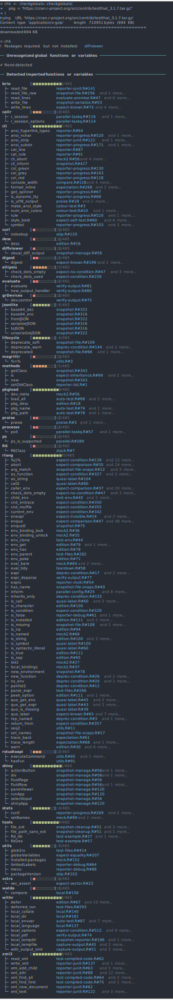

<!-- README.md is generated from README.Rmd. Please edit that file -->

# {checkglobals}: On-the-fly detection of R-code dependencies

<!-- badges: start -->

[](https://cran.r-project.org/package=checkglobals)
[](https://github.com/JorisChau/checkglobals/actions)
[](https://app.codecov.io/gh/JorisChau/checkglobals)
[](https://CRAN.R-project.org/package=checkglobals)
<!-- badges: end -->

The minimal {checkglobals}-package allows to approximately detect global
and imported functions or variables from R-source code or R-packages by
inspecting the internal syntax trees of the code, (i.e. *static code
analysis*). The aim of this package is to serve as a fast and
light-weight alternative to `codetools::findGlobals()` to check
R-packages or R-scripts for missing function imports and/or variable
definitions on-the-fly without the need for package installation or code
execution. The code inspection procedures are implemented using R’s
internal C API, and no external R-package dependencies are strictly
required (only [cli](https://CRAN.R-project.org/package=cli) is
suggested for interactive use).

## Installation

``` r
# Install the development version from GitHub:
# install.packages("devtools")
devtools::install_github("JorisChau/checkglobals")
```

## Example usage

### R-scripts

The {checkglobals}-package contains a single wrapper function
`checkglobals()` to inspect R-scripts, folders, R-code strings or
R-packages. Individual R-scripts can be scanned for global variables and
imported functions using the `file` argument:


<br>

The R-script in this example contains a simple R-Shiny application
available at
<https://raw.githubusercontent.com/rstudio/shiny-examples/main/004-mpg/app.R>.

#### Printed output

Printing the S3-object returned by `checkglobals()` outputs: 1. the
*name* and *location* of all unrecognized global variables; and 2. the
*name* and *location* of all detected imported functions grouped by
R-package.

The *location* `app.R#36` lists the R-file name (`app.R`) and line
number (`36`). If [cli](https://CRAN.R-project.org/package=cli) is
installed and cli-hyperlinks are supported, clicking the *location*
links opens the source file at the given line number.

To inspect only the detected global variables or imported functions,
index the S3-object by its `globals` (`chk$globals`) or `imports`
(`chk$imports`) components. For instance, we can print detailed source
code references of the unrecognized global variables with:


#### Remote files

The `file` argument in `checkglobals()` also accepts remote file
locations (e.g. a server or the web), in which case the remote file is
first downloaded as a temporary file with `download.file()`.


<br>

**Note**: the bars behind the external package names are filled based on
the number of detected imports per package. Depending on the context,
R-packages with only 1 or 2 function imports may be good candidates for
removal to reduce the number of package dependencies.

### Folders

Folders containing R-scripts can be scanned with the `dir` argument in
`checkglobals()`, which inspects all R-scripts present in `dir`. The
following example scans an R-Shiny app folder containing a `ui.R` and
`server.R` file (source:
<https://github.com/rstudio/shiny-examples/tree/main/018-datatable-options>),


<br>

**Note**: if imports are detected from an R-package not installed in the
current R-session, an alert is printed as in the example above. Function
calls accessing the missing R-package explicitly, using e.g. `::` or
`:::`, can still be fully identified as imports by `checkglobals()`.
Function calls with no reference to the missing R-package will be listed
as unrecognized globals.

### R-packages

R-packages can be scanned using the `pkg` argument in `checkglobals()`.
Conceptually, `checkglobals()` scans all files in the R-folder and
contrasts the detected (unrecognized) globals and imports against the
imports listed in the NAMESPACE of the R-package. R-scripts present
elsewhere in the R-package (i.e. not in the R-folder) are *not* scanned,
as these are not coupled to the package NAMESPACE file. To illustrate,
we can run `checkglobals()` on the checkglobals R-package folder itself:


#### Bundled R-packages

Instead of local R-package folders, the `pkg` argument also accepts file
paths to bundled (tar.gz) R-packages. This can either be from a location
on the local filesystem, or from a remote file location, such as the web
(similar to the `file` argument).

##### Local filesystem:


##### Remote file location:



<br>

**Remark**: if `checkglobals()` is called without a `file`, `dir`,
`text` or `pkg` argument, the function is run in the current working
directory. If the current working directory is an R-package folder, this
is identical to `checkglobals(pkg = ".")`, otherwise the behavior is the
same as `checkglobals(dir = ".")`.

### Programmatic use

Several methods are available to cast the S3-object returned by
`checkglobals()` to common R-objects. This can be useful for further
programmatic use of the function output. Currently, the following
casting methods are available: `as.data.frame()`, `as.matrix()`,
`as.character()` and `as_vector()`.

``` r
chk <- checkglobals::checkglobals(pkg = "../checkglobals")

## data.frame with globals/imports 
as.data.frame(chk)
#>                 name package   type
#> 1         ansi_align     cli import
#> 2         ansi_nchar     cli import
#> 3       ansi_strtrim     cli import
#> 4        ansi_trimws     cli import
#> 5  cli_alert_success     cli import
#> 6  cli_alert_warning     cli import
#> 7             cli_h1     cli import
#> 8     code_highlight     cli import
#> 9           col_blue     cli import
#> 10         col_green     cli import
#> 11          col_grey     cli import
#> 12           col_red     cli import
#> 13        col_yellow     cli import
#> 14     console_width     cli import
#> 15        style_bold     cli import
#> 16   style_hyperlink     cli import
#> 17      style_italic     cli import
#> 18            symbol     cli import
#> 19              tree     cli import
#> 20     download.file   utils import
#> 21            relist   utils import
#> 22             untar   utils import

## vector of package dependencies
checkglobals::as_vector(chk)[["package"]]
#> [1] "cli"   "utils"
```

## Useful references

Other useful functions and R-packages with design goals and/or
functionality related to {checkglobals} include:

-   `codetools::findGlobals()`, detects global variables from R-scripts
    via static code analysis. This and other *codetools* functions
    underlie the source code checks run by `R CMD check`.
-   [globals](https://CRAN.R-project.org/package=globals), R-package
    by H. Bengtsson providing a reimplementation of the functions in
    *codetools* to identify global variables using various strategies
    for export in parallel computations.
-   `renv::dependencies()`, detects R-package dependencies by scanning
    all R-files in a project for imported functions or packages via
    static code analysis.
-   [lintr](https://CRAN.R-project.org/package=lintr), R-package by J.
    Hester and others to perform general static code analysis in R
    projects. `lintr::object_usage_linter()` provides a wrapper of
    `codetools::checkUsage()` to detect global variables similar to
    `R CMD check`.

## License

MIT
